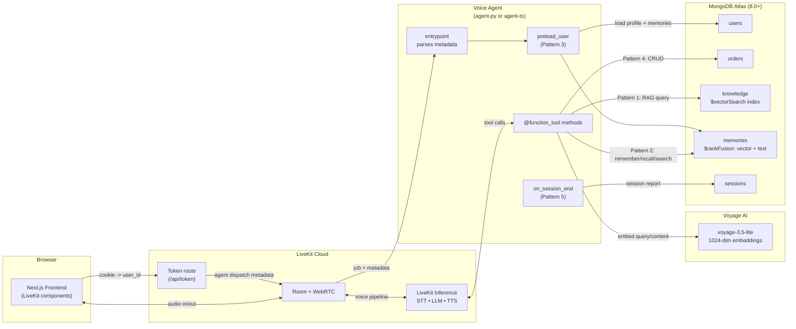

# LiveKit + MongoDB Atlas Voice Agent Starter

A starter kit that wires a [LiveKit Agents](https://docs.livekit.io/agents) voice agent (Python or Node) into [MongoDB Atlas](https://www.mongodb.com/atlas) and pairs it with a [Next.js frontend](https://github.com/livekit-examples/agent-starter-react). The agent demonstrates five MongoDB integration patterns: RAG with `$vectorSearch`, agentic memory with `$rankFusion`, pre-loaded user context, function-tool CRUD, and session report persistence.

For package-specific detail, see [`agent-py/README.md`](./agent-py/README.md), [`agent-ts/README.md`](./agent-ts/README.md), and [`frontend/README.md`](./frontend/README.md). This top-level README is the runbook for working with them together.

## Architecture



**Pattern legend.** Each labeled edge maps to one of the five integration patterns:

- **Pattern 1 — RAG with `$vectorSearch`:** `Tools → Knowledge` runs the `search_knowledge` tool, which embeds the query through Voyage and reads from the `knowledge` collection's vector index.
- **Pattern 2 — Agentic memory with `$rankFusion`:** `Tools → Memories` powers `remember_detail` / `recall_detail` / `search_memories`, combining `$vectorSearch` and `$search` results in a hybrid pipeline.
- **Pattern 3 — Pre-loaded user context:** `Preload → Users` and `Preload → Memories` warm the chat context with the user's profile and prior memories before the LLM speaks.
- **Pattern 4 — Function-tool CRUD:** `Tools → Orders` is the canonical example; the same shape applies to any domain collection you swap in.
- **Pattern 5 — Session report persistence:** `Hangup → Sessions` writes the structured `SessionReport` on disconnect for analytics and audit.

## Repo layout

```
code/
├── package.json        # root orchestrator (scripts only, no workspaces)
├── README.md
├── LICENSE
├── .gitignore
├── agent-py/           # Python voice agent (uv + LiveKit Agents + PyMongo)
│   ├── src/
│   ├── tests/
│   └── pyproject.toml
├── agent-ts/           # Node voice agent (pnpm + @livekit/agents + mongodb driver)
│   ├── src/
│   ├── tests/
│   └── package.json
└── frontend/           # Next.js frontend (pnpm + LiveKit components)
    ├── app/
    ├── components/
    └── package.json
```

The root `package.json` is a thin script runner backed by [`concurrently`](https://www.npmjs.com/package/concurrently). It shells into `agent-py/` via `uv --directory`, into `agent-ts/` and `frontend/` via `pnpm --dir`, so you never need to `cd` manually for day-to-day work. Pick a runtime with `pnpm dev:py` or `pnpm dev:ts`; only run one at a time, since both register under the same `AGENT_NAME`.

## Prerequisites

- Node.js 22+ and [pnpm](https://pnpm.io/) 10+ (Corepack auto-manages the pinned version when enabled)
- Python 3.11+ and [uv](https://docs.astral.sh/uv/) (only required if you run the Python agent)
- [MongoDB Atlas](https://www.mongodb.com/atlas) cluster on MongoDB 8.0 or later (required for `$rankFusion` in the agentic memory pattern)
- [LiveKit Cloud](https://cloud.livekit.io) project
- [Voyage AI](https://www.voyageai.com/pricing) API key (free tier is enough for prototyping)

## Picking a runtime

The starter ships with two equivalent agent implementations and you can build with either one. Both expose the same five MongoDB integration patterns and connect to the same Atlas cluster, so you can switch between them without re-seeding data.

| Command          | Agent package | Runtime              | Use when                                                                  |
| ---------------- | ------------- | -------------------- | ------------------------------------------------------------------------- |
| `pnpm dev:py`    | `agent-py/`   | Python 3.11+ via uv  | You prefer Python, want full feature parity, or need `agent:py:console`   |
| `pnpm dev:ts`    | `agent-ts/`   | Node 22+ via pnpm    | You prefer TypeScript or are deploying alongside other Node services      |

> **Only run one runtime at a time.** Both register under the same `AGENT_NAME` (`my-agent` by default), so the LiveKit dispatch will route to whichever one connects first. To run them side-by-side for comparison, change `agent_name` in one of them and the matching `AGENT_NAME` in `frontend/.env.local`.

`pnpm dev` (no suffix) is intentionally not a shortcut. It prints a hint and exits non-zero so you always pick a runtime explicitly.

## One-time setup

```bash
pnpm setup                       # installs all three packages and copies .env.local files
# fill in agent-py/.env.local, agent-ts/.env.local, frontend/.env.local
# (see "Environment variables" below)
pnpm agent:py:download-files     # Python: fetches VAD + turn detector models once
pnpm agent:ts:download-files     # Node:   same, for the TS agent (skip if you only run Python)
pnpm db:init                     # creates Mongo collections and vector search indexes
pnpm db:seed                     # inserts sample users, orders, and knowledge docs
```

Vector search indexes on Atlas take one to two minutes to become queryable after `pnpm db:init`. If a search returns nothing right after setup, give it a moment and retry.

## Running

```bash
pnpm dev:py             # Python agent (dev mode) + frontend together
pnpm dev:ts             # Node   agent (dev mode) + frontend together
pnpm dev:frontend       # just the Next.js app
pnpm dev:agent-py       # just the Python agent in dev mode
pnpm dev:agent-ts       # just the Node agent in dev mode
pnpm agent:py:console   # speak to the Python agent in your terminal (Node has no console mode)
pnpm agent:py:start     # Python agent in production mode
pnpm agent:ts:start     # Node   agent in production mode
```

`pnpm dev:py` and `pnpm dev:ts` prefix each line with the runtime name and `frontend` so interleaved logs stay readable.

## Build, lint, test

```bash
pnpm build              # production build of the Next.js frontend
pnpm start:frontend     # run the built frontend

pnpm lint               # ruff (agent-py) + eslint (agent-ts) + next lint (frontend), in parallel
pnpm lint:agent-py      # ruff check only
pnpm lint:agent-ts      # eslint only
pnpm lint:frontend      # next lint only
pnpm format             # ruff format + prettier (agent-ts) + prettier (frontend)

pnpm test               # runs both pytest (agent-py) and vitest (agent-ts), sequentially
pnpm test:agent-py      # pytest only
pnpm test:agent-ts      # vitest only
```

## Script reference

| Script                          | What it does                                                                          |
| ------------------------------- | ------------------------------------------------------------------------------------- |
| `pnpm setup`                    | Installs all three packages and copies `.env.example` to `.env.local` in each         |
| `pnpm install:frontend`         | `pnpm install` inside `frontend/`                                                     |
| `pnpm install:agent-py`         | `uv sync` inside `agent-py/`                                                          |
| `pnpm install:agent-ts`         | `pnpm install` inside `agent-ts/`                                                     |
| `pnpm env:copy`                 | Idempotently copies `.env.example` to `.env.local` in all three packages              |
| `pnpm dev`                      | Prints "use `dev:py` or `dev:ts`" and exits — no implicit default                     |
| `pnpm dev:py`                   | Python agent (dev) + frontend together with labeled logs                              |
| `pnpm dev:ts`                   | Node agent (dev) + frontend together with labeled logs                                |
| `pnpm dev:frontend`             | `pnpm dev` inside `frontend/`                                                         |
| `pnpm dev:agent-py`             | `uv run src/agent.py dev` inside `agent-py/`                                          |
| `pnpm dev:agent-ts`             | `pnpm dev` inside `agent-ts/`                                                         |
| `pnpm agent:py:console`         | Python console mode; speak to the agent in your terminal                              |
| `pnpm agent:py:start`           | Python agent in production mode                                                       |
| `pnpm agent:py:download-files`  | One-time VAD + turn detector model download (Python)                                  |
| `pnpm agent:ts:start`           | Node agent in production mode                                                         |
| `pnpm agent:ts:download-files`  | One-time VAD + turn detector model download (Node)                                    |
| `pnpm db:init`                  | Creates Mongo collections and vector search indexes (`agent-py/src/db/indexes.py`)    |
| `pnpm db:seed`                  | Inserts sample users, orders, and knowledge docs (`agent-py/src/db/seed.py`)          |
| `pnpm db:init:ts`               | Same, but driven by the TS implementation (`agent-ts/src/db/indexes.ts`)              |
| `pnpm db:seed:ts`               | Same, but driven by the TS implementation (`agent-ts/src/db/seed.ts`)                 |
| `pnpm build`                    | Production build of the frontend                                                      |
| `pnpm start:frontend`           | Runs the built frontend                                                               |
| `pnpm lint`                     | Lints all three packages in parallel                                                  |
| `pnpm format`                   | Formats all three packages                                                            |
| `pnpm test`                     | Runs both `agent-py` (pytest) and `agent-ts` (vitest) suites sequentially             |

## Environment variables

Three `.env.local` files, one per package. `pnpm env:copy` (run by `pnpm setup`) seeds them from the checked-in `.env.example` files.

- [`agent-py/.env.example`](./agent-py/.env.example) covers `LIVEKIT_URL`, `LIVEKIT_API_KEY`, `LIVEKIT_API_SECRET`, `MONGODB_URI`, `MONGODB_DB` (optional), `VOYAGE_API_KEY`.
- [`agent-ts/.env.example`](./agent-ts/.env.example) covers the same set as `agent-py/.env.example`.
- [`frontend/.env.example`](./frontend/.env.example) covers `LIVEKIT_URL`, `LIVEKIT_API_KEY`, `LIVEKIT_API_SECRET`, `AGENT_NAME`, and two sandbox-only vars.

The `LIVEKIT_*` credentials must match across all three files. If you have the LiveKit CLI installed, `lk app env -w -d agent-py/.env.local` populates the LiveKit block (run it once per agent package).

## Agent dispatch

The frontend dispatches to the agent registered as `my-agent`. Both [`agent-py/src/agent.py`](./agent-py/src/agent.py) and [`agent-ts/src/main.ts`](./agent-ts/src/main.ts) register under that name, so only the runtime you started with `pnpm dev:py` or `pnpm dev:ts` will pick up jobs. To change the dispatch target, update `agent_name` (Python) or `agentName` (TS) along with `AGENT_NAME` in `frontend/.env.local`. Leaving `AGENT_NAME` blank enables automatic dispatch instead of named dispatch.

## Who is the user?

The agent uses two fields to scope every MongoDB read and write: `user_id` and `tenant_id`. The token route owns them and ships them to the agent through [agent dispatch metadata](https://docs.livekit.io/agents/server/agent-dispatch/):

1. [`app/api/token/route.ts`](./frontend/app/api/token/route.ts) reads an httpOnly cookie named `lk_mongo_user_cookie`. On first visit it mints one with `crypto.randomUUID()` and sets it on the response.
2. The same route builds a `RoomConfiguration` with `agents: [new RoomAgentDispatch({ agentName, metadata })]` where `metadata` is the JSON-stringified `{ user_id, tenant_id }`. Any `room_config` the client sent in the request body is ignored.
3. [`components/app/app.tsx`](./frontend/components/app/app.tsx) uses `TokenSource.endpoint('/api/token')`. Same-origin `fetch` auto-attaches cookies, so no client-side code touches the id.
4. On the agent side, `my_agent` in [`src/agent.py`](./agent-py/src/agent.py) parses `ctx.job.metadata` before `ctx.connect()` so `preload_user` can run in parallel with the room connection.

Console mode (`pnpm agent:py:console`, Python only) has no frontend, so the agent falls back to `DEFAULT_USER_ID = "user_1"` and the seeded profile in [`agent-py/src/db/seed.py`](./agent-py/src/db/seed.py).

This is anonymous identity, not authentication. Clearing the cookie produces a new id and a new user profile on the agent side. For production, replace the `req.cookies.get(COOKIE_NAME)` block in `app/api/token/route.ts` with your session lookup (NextAuth, Clerk, Supabase, Better-Auth) and fall through to the anonymous cookie only for guests. The frontend and agent stay the same.

## License

[MIT](./LICENSE)
